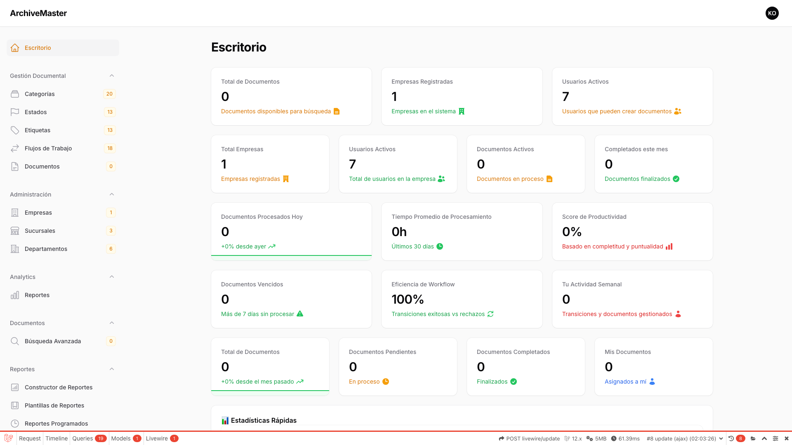
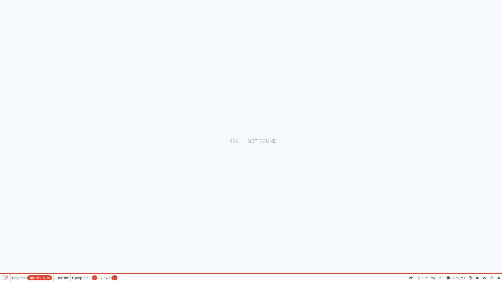

# 📖 Manual de Función - ArchiveMaster

Este manual contiene las capturas de pantalla de las principales funcionalidades del sistema de gestión documental.

## 🖼️ Capturas del Sistema

### Dashboard

### Lista de Archivos

### Oficinas

:::info Actualizar Manual
Ejecuta `npm run capture archivemaster` para generar nuevas capturas automáticamente desde la aplicación en vivo.

El sistema capturará automáticamente:
- Dashboard principal
- Módulo de archivos
- Módulo de oficinas
:::

## 📝 Notas de Uso

Las capturas se generan automáticamente usando Playwright, conectándose a la aplicación en vivo y navegando por las rutas configuradas.
