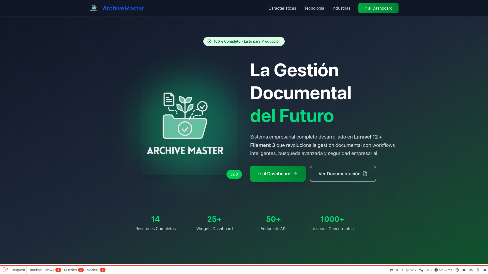
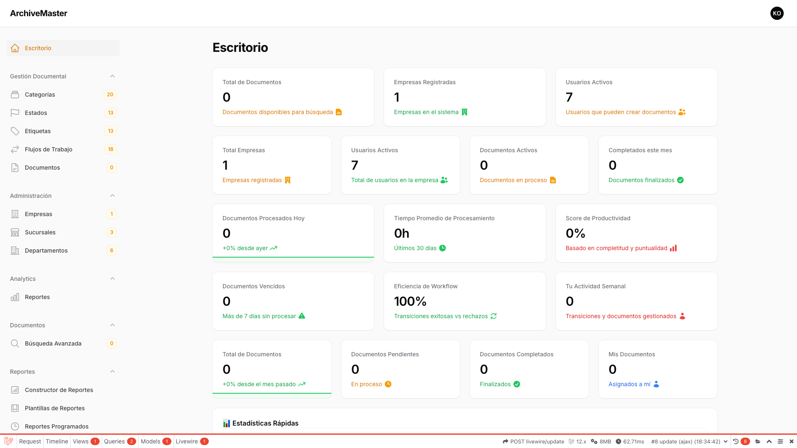

# 📖 Manual de Función - ARCHIVEMASTER

Este manual contiene las capturas de pantalla de todas las funcionalidades del sistema.

:::info Actualización Automática
Ejecuta `npm run capture archivemaster` para regenerar todas las capturas automáticamente desde la aplicación en vivo.
Las capturas se generan usando Playwright conectándose a https://archive-master-app.test
:::

## 🖼️ Capturas del Sistema

### Home

#### Welcome

**Ruta:** `/`

---

### Admin

#### Admin Login

**Ruta:** `/admin/login`

---

