# 📖 Manual de Función - PQR

Este manual contiene las capturas de pantalla de todas las funcionalidades del sistema.

:::info Actualización Automática
Ejecuta `npm run capture pqr` para regenerar todas las capturas automáticamente desde la aplicación en vivo.
Las capturas se generan usando Playwright conectándose a https://sistema-pqrsd.test
:::

## 🖼️ Capturas del Sistema

### Home

#### Home

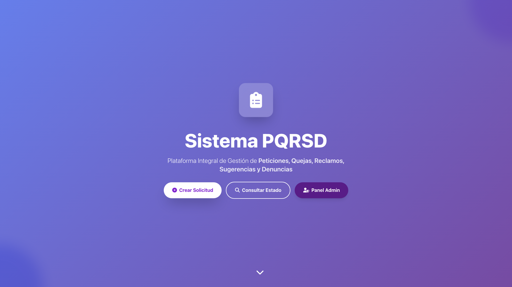

**Ruta:** `/`

---

### Login

#### Login

**Ruta:** `/login`

---

### Register

#### Register

**Ruta:** `/register`

---

### Forgot-password

#### Forgot Password

**Ruta:** `/forgot-password`

---

### Two-factor-challenge

#### Two Factor Challenge

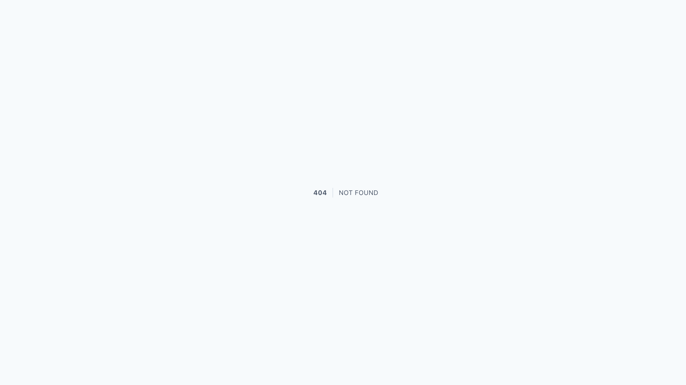

**Ruta:** `/two-factor-challenge`

---

### Confirm-password

#### Confirm Password

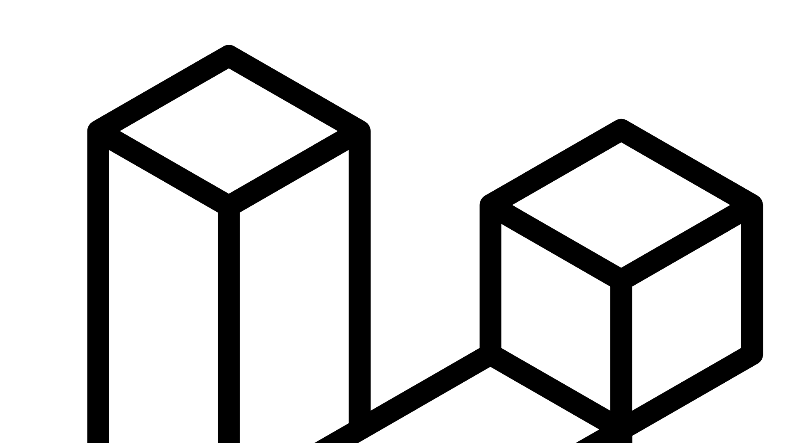

**Ruta:** `/confirm-password`

---

### Verify-email

#### Verify Email

**Ruta:** `/verify-email`

---

### Support

#### Support

**Ruta:** `/support`

---

### Tracking

#### Tracking

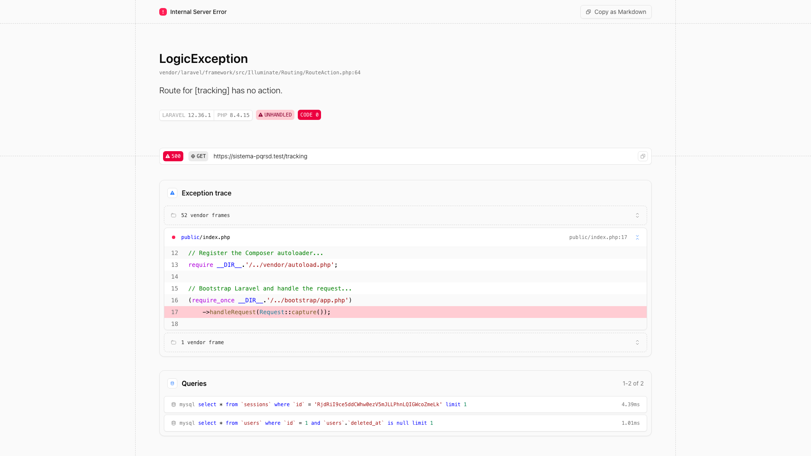

**Ruta:** `/tracking`

---

### Admin

#### Admin Dashboard

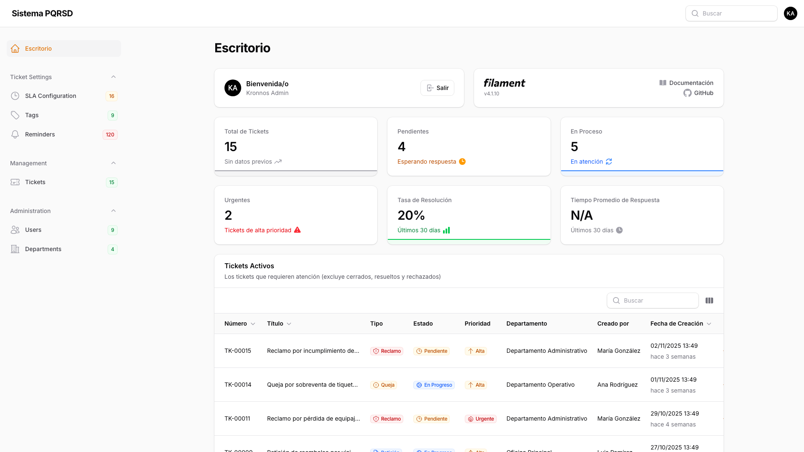

**Ruta:** `/admin`

---

#### Admin Login

**Ruta:** `/admin/login`

---

#### Admin Tickets List

**Ruta:** `/admin/tickets`

---

#### Admin Tickets Create

**Ruta:** `/admin/tickets/create`

---

#### Admin Users List

**Ruta:** `/admin/users`

---

#### Admin Users Create

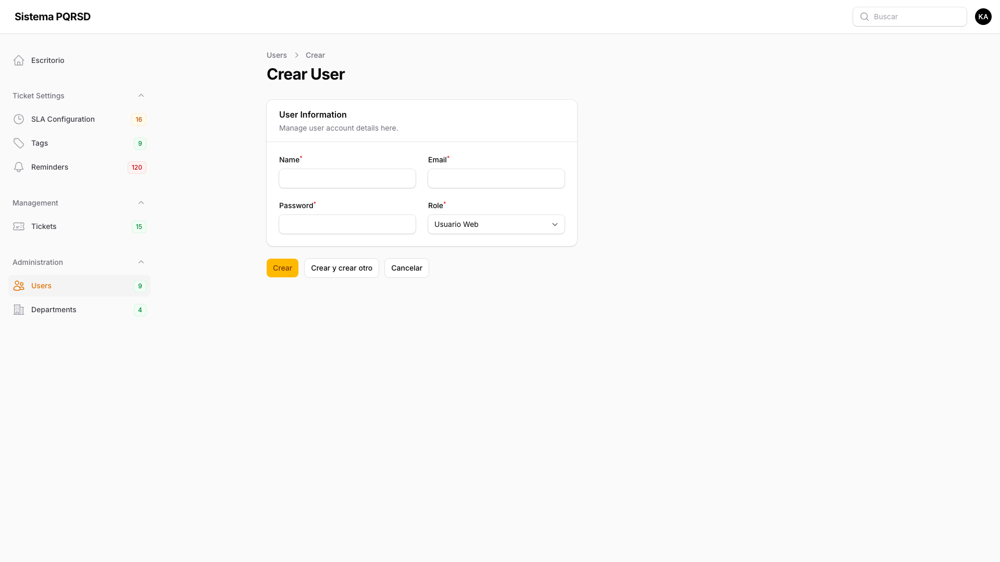

**Ruta:** `/admin/users/create`

---

#### Admin Departments List

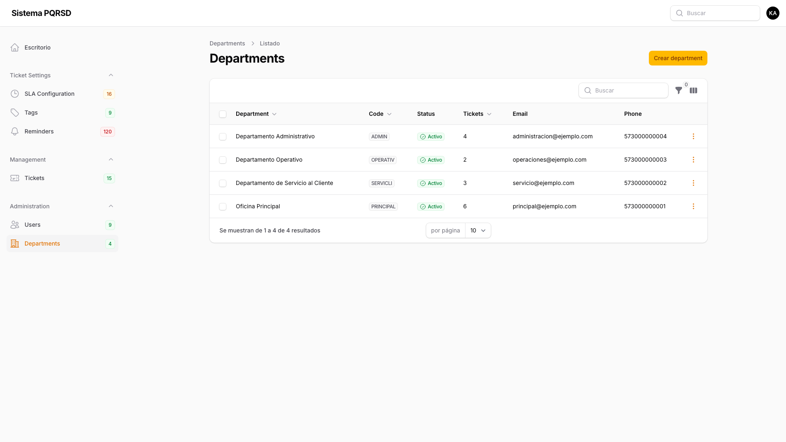

**Ruta:** `/admin/departments`

---

#### Admin Departments Create

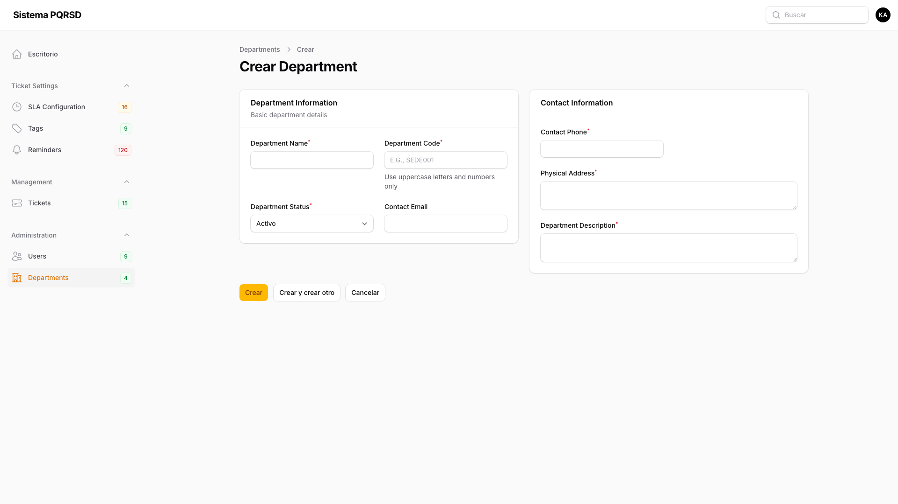

**Ruta:** `/admin/departments/create`

---

#### Admin Slas List

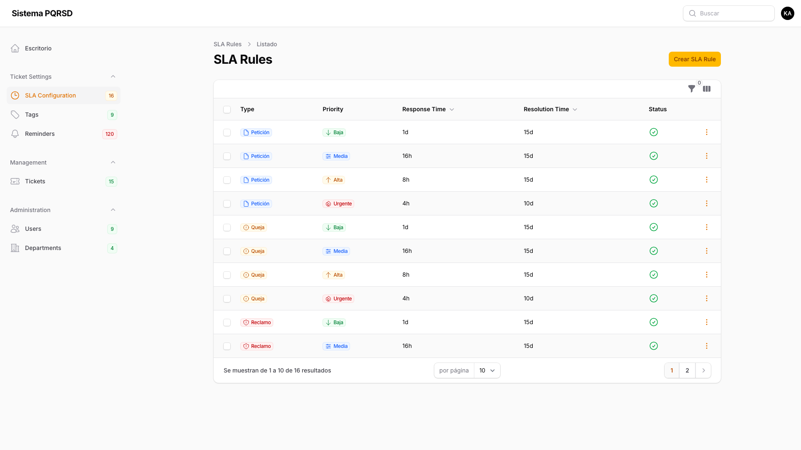

**Ruta:** `/admin/s-l-a-s`

---

#### Admin Slas Create

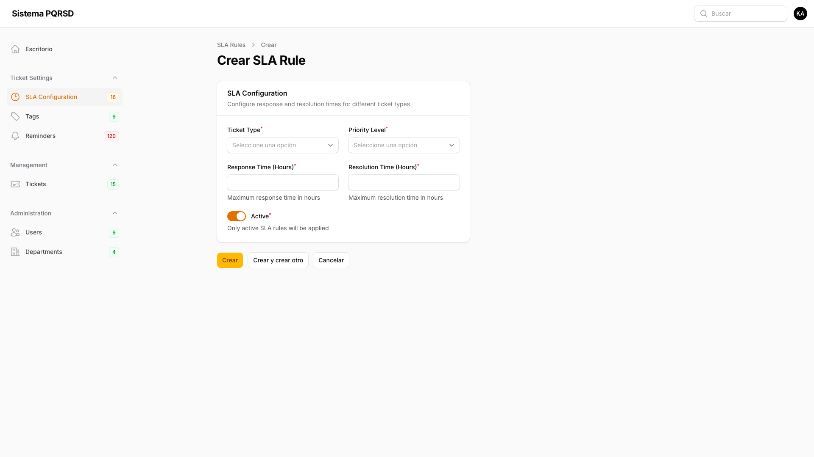

**Ruta:** `/admin/s-l-a-s/create`

---

#### Admin Tags List

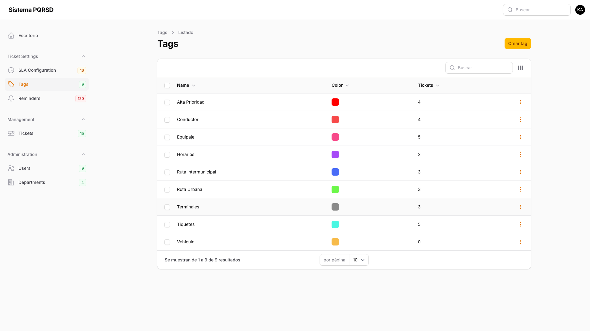

**Ruta:** `/admin/tags`

---

#### Admin Tags Create

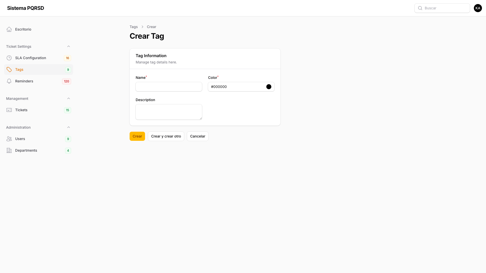

**Ruta:** `/admin/tags/create`

---

#### Admin Reminders List

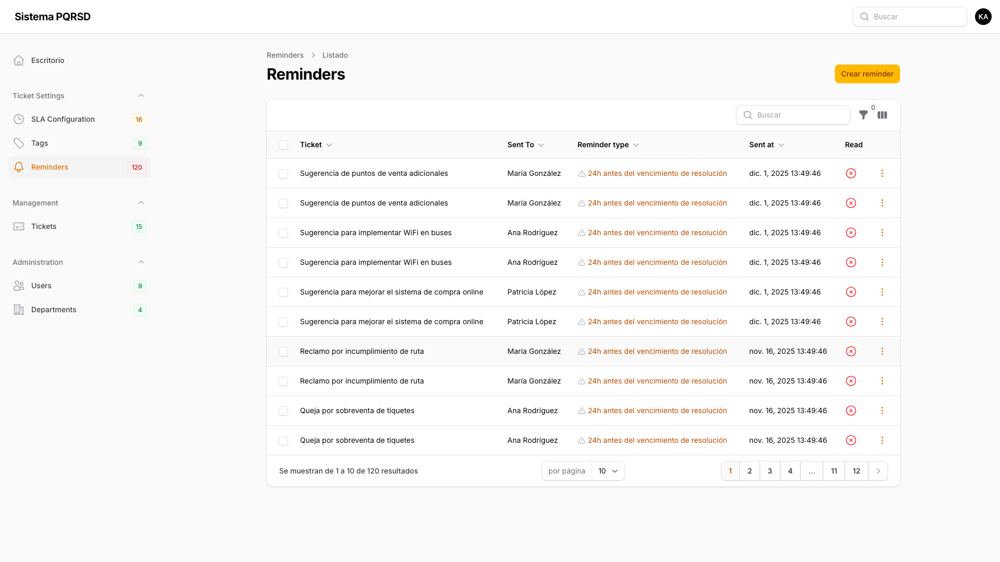

**Ruta:** `/admin/reminders`

---

#### Admin Reminders Create

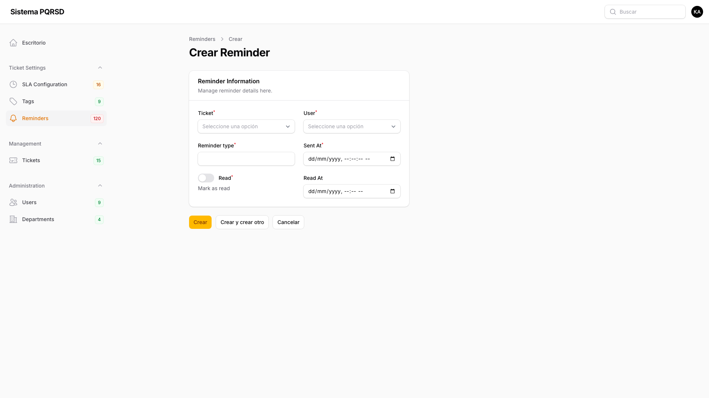

**Ruta:** `/admin/reminders/create`

---

### Log-viewer

#### Log Viewer

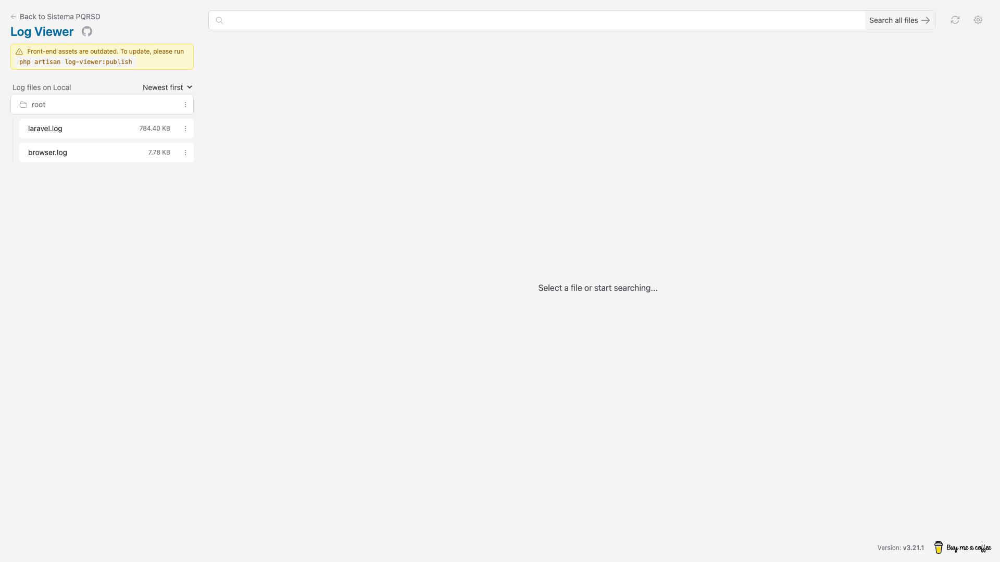

**Ruta:** `/log-viewer`

---

### Publish-log-viewer

#### Publish Log Viewer

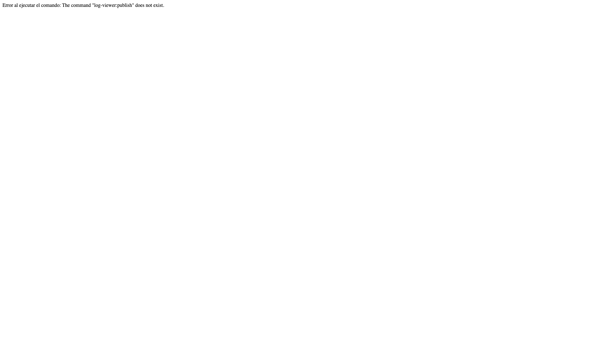

**Ruta:** `/publish-log-viewer`

---

