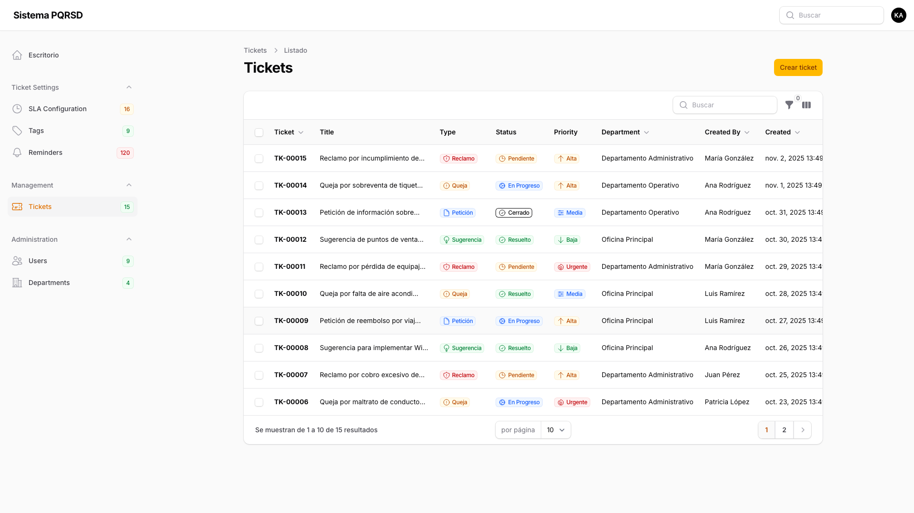
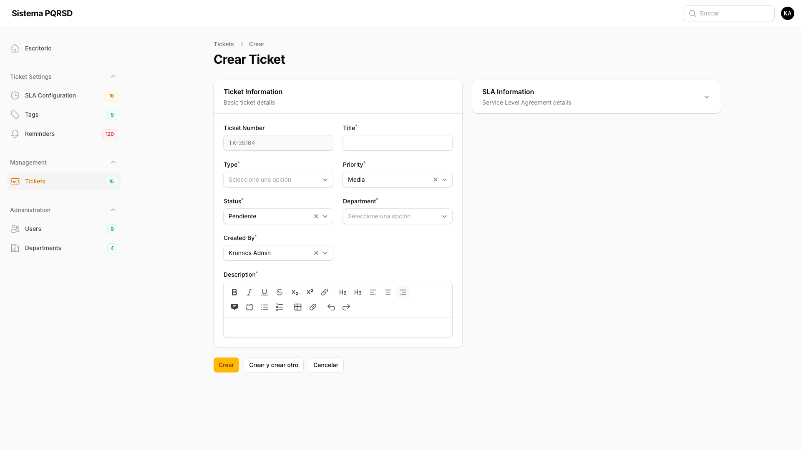
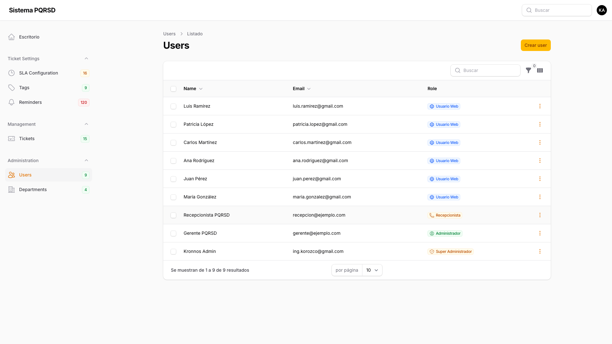

# 📖 Manual de Función - Sistema PQRSD

Este manual contiene las capturas de pantalla de las principales funcionalidades del sistema de gestión de peticiones, quejas, reclamos y sugerencias.

## 🖼️ Capturas del Sistema

### Dashboard

### Lista de Tickets

### Crear Ticket

### Lista de Usuarios

:::info Actualizar Manual
Ejecuta `npm run capture pqr` para generar nuevas capturas automáticamente desde la aplicación en vivo.

El sistema capturará automáticamente:
- Dashboard principal
- Módulo de tickets (lista y creación)
- Módulo de usuarios
:::

## 📝 Notas de Uso

Las capturas se generan automáticamente usando Playwright, conectándose a la aplicación en vivo y navegando por las rutas configuradas.
